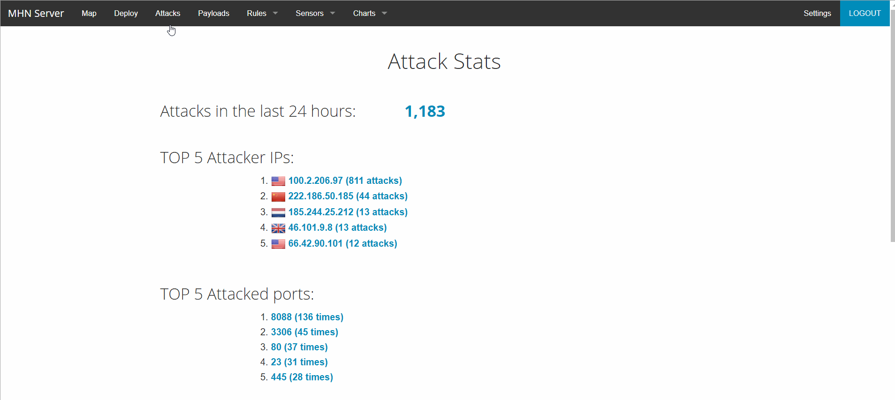

# MHN-Honeypot-testing
## Honepots deployed
 - Dionaea
 - Suricata

## Issues Encountered
 - An issue with installing MHN was that ``scripts/instal_hpfeeds.sh`` tried to clone a repository that it did not have access to. I fixed it by using a fork of the repository under couozu
 - MHN admin would eat up all of its memory after a few minutes so I wasn't able to add many more honeypots

## Summary of data
 - 

## Unresolved Questions
I am not aware of what the signatures for the payloads mean or where to find their meanings.
